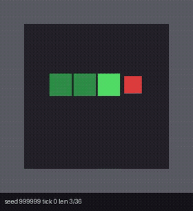

# Sentinel

> An open, self-hosted **System One** decision API — wire-compatible with
> TypeSafe's Jev. Calibrated probabilities from Qwen3.8-27B, one forward pass
> per decision, running locally on consumer AMD hardware.

```
POST http://127.0.0.1:8915/v1/systemone
{"state": "...", "model": "sentinel",
 "questions": {"dept": {"type": "choice",
   "instructions": "Which team should handle this?",
   "criteria": {"billing": "Payments", "technical": "Bugs"}}}}
```

Benchmark (public JevBench-231): **87.9%** accuracy / **77.0** score —
Jev (closed, hosted): 86.6% / 75.4. Calibrated (ECE 0.049, T=1.2). Wire
compatible: any Jev client works by swapping the endpoint.

## Layout

| Path | What |
|---|---|
| [`skill/`](skill/) | Agent skill (Claude Code / pi / opencode / any SKILL.md agent) |
| [`server/`](server/) | The `/v1/systemone` FastAPI proxy + start script |
| [`game/`](game/) | LLM+oracle Snake demo: Hamiltonian fill-the-map, 36/36 (video in docs/) |
| [`docs/`](docs/) | Reference docs + benchmark/case-study notes |

## Stack

- Backend: llama.cpp (Vulkan coopmat2) + `Qwen3.8-27B` UD-Q4_K_M on a Radeon
  AI PRO R9700 (32GB) — one decision = one forward pass, `output_tokens: 0`.
- Proxy: FastAPI letter-logit readout, temperature-calibrated (T=1.2),
  confidence + abstain fields, TypeSafe wire format.
- Latency: p50 ~0.4s, p95 ~3s (single slot; ~1000 tok/s prefill).

## Quick start

```bash
bash server/start-sentinel.sh          # starts backend (:8912) + proxy (:8915)
curl -s http://127.0.0.1:8915/v1/systemone -H 'Content-Type: application/json' \
  -d '{"state":"Help! payouts failing 3 days","model":"sentinel",
       "questions":{"urgent":{"type":"noul","instructions":"Does this convey urgency?"}}}'
```

Requirements: Linux + AMD GPU (RDNA4 tested), llama.cpp, Python 3.12 with
fastapi/uvicorn/transformers. See [docs/operations.md](docs/operations.md).

## The skill

`skills/sentinel/SKILL.md` teaches any agent (Claude Code, pi, opencode,
muse-spark...) to call the API: the three primitives, response contract,
patterns (route, select, gate, rerank, fan-out), and operations. Install:

```bash
cp -r skill ~/.claude/skills/sentinel      # Claude Code
cp -r skill ~/.pi/agent/skills/sentinel    # pi
cp -r skill <project>/.opencode/skills/sentinel  # opencode
```

> The skill was largely inspired by [TypeSafe's typesafe-ai SKILL.md](https://github.com/typesafe-ai/skills)
> (MIT) — same philosophy and structure, rewritten for the self-hosted Sentinel API.

Validated end-to-end: an autonomous muse-spark-1.3 opencode session used the
skill to build a Snake game where Sentinel makes 100% of the moves, and filled
the entire 36-cell board (36/36, 263 decisions, untuned seed).



*Autonomous muse-spark session: Sentinel makes 100% of the moves; the board
fills 36/36 on an untuned seed. Video: [`docs/sentinel-snake-fill.mp4`](docs/sentinel-snake-fill.mp4),
case study in [`docs/case-study.md`](docs/case-study.md), run report in
[`docs/RESULT-snake.md`](docs/RESULT-snake.md).*

## License

MIT. Skill adapted from typesafe-ai/skills (MIT).
